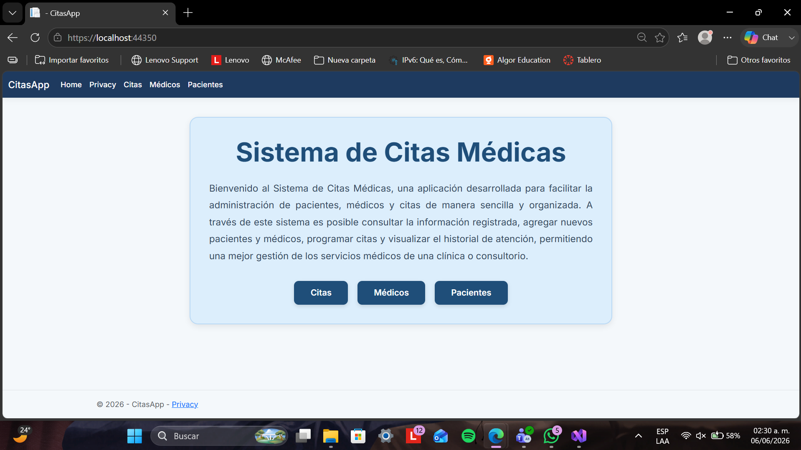
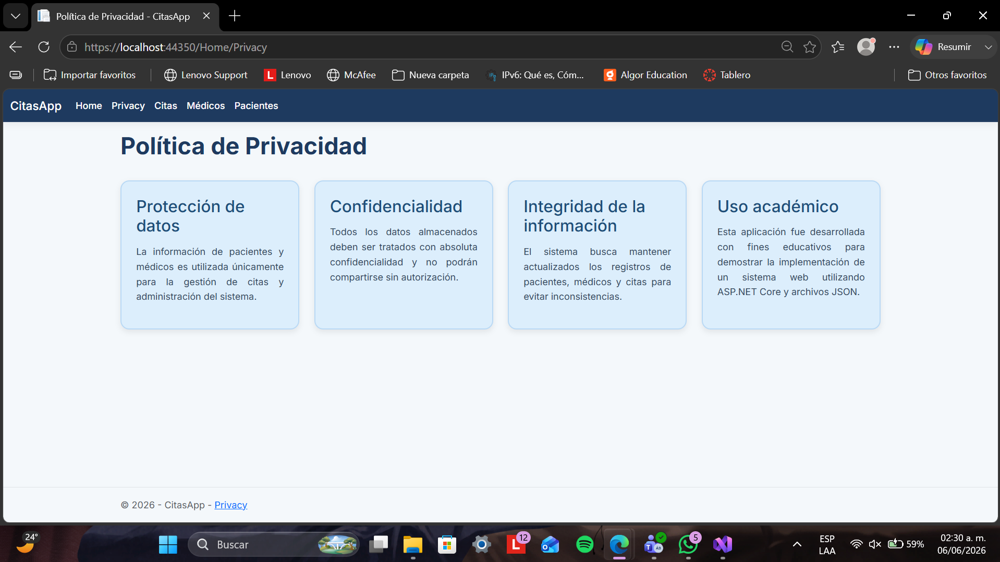
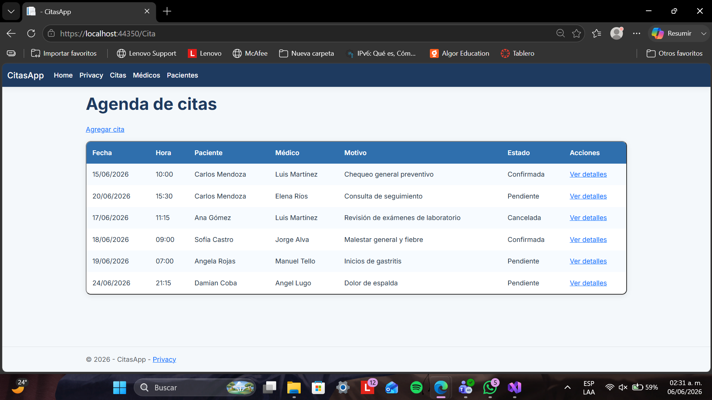
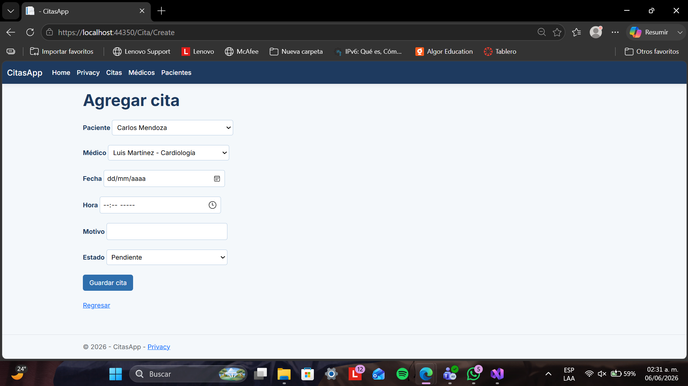
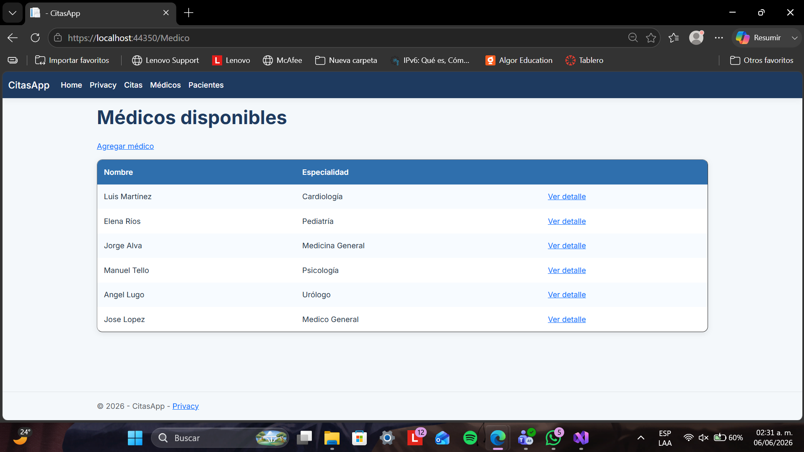
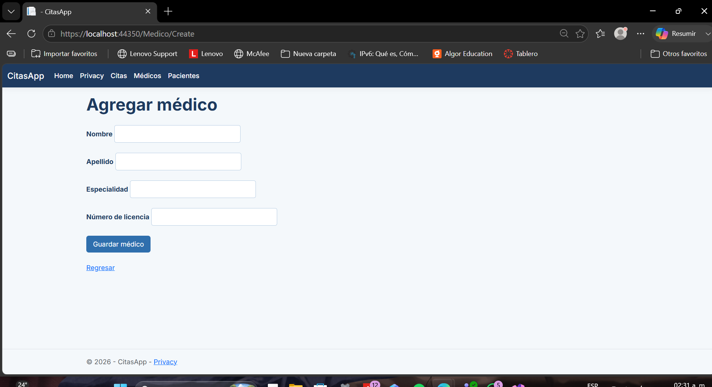
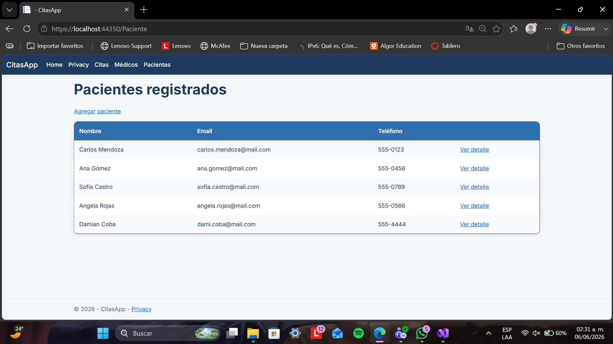
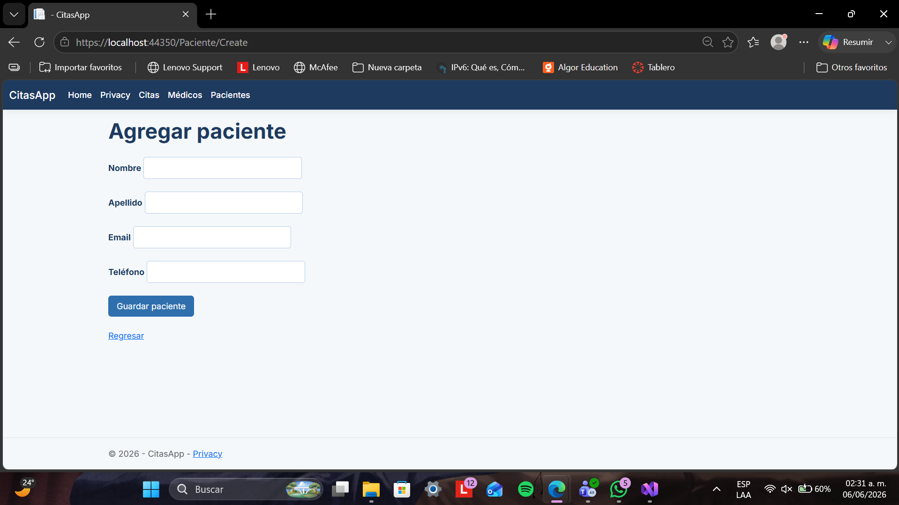

# Actividad #14 – Práctica .NET: Implementar MVC con ASP.NET Core

## 📌 Datos institucionales

- **Universidad:** Tecnológico de Software
- **Materia:** Arquitectura de Software
- **Proyecto:** Juego de Ahorcado en Consola
- **Alumno:** Ángela Yaritzi Rojas Brito
- **Grupo:** 3B
- **Profesor:** Jorge Javier Pedrozo Romero
- **Fecha:** 05/06/26

---

# 📖 Descripción del proyecto

El Sistema de Citas Médicas es una aplicación web diseñada para facilitar la administración de pacientes, médicos y citas dentro de un consultorio o clínica.

El sistema permite registrar nuevos pacientes y médicos, programar citas médicas, así como consultar la información almacenada mediante una interfaz sencilla y organizada. Su objetivo es centralizar el control de las citas y mantener un registro básico de la información necesaria para la atención de los pacientes.

---

# 🚀 Tecnologías Utilizadas

Durante el desarrollo del proyecto se utilizaron las siguientes tecnologías y herramientas:

- ASP.NET Core MVC para la arquitectura y desarrollo de la aplicación web.
- C# como lenguaje principal de programación.
- Razor Views (.cshtml) para la construcción de las interfaces de usuario.
- HTML5 para la estructura de las páginas web.
- CSS3 para el diseño y personalización de la interfaz gráfica.
- JSON como mecanismo de almacenamiento y persistencia de datos.
- Visual Studio 2022 como entorno de desarrollo integrado (IDE).
- .NET 8 como plataforma de ejecución del proyecto.
- Git para el control de versiones del código fuente.
- GitHub para el alojamiento y gestión del repositorio del proyecto.
- Bootstrap (incluido en la plantilla base de ASP.NET Core) para algunos componentes y estilosresponsivos de la interfaz.


---

# 📌 Características

- Registro de nuevos pacientes.
- Registro de médicos con su información correspondiente.
- Programación de citas médicas mediante la selección de un paciente y un médico.
- Visualización de listas de pacientes, médicos y citas en formato de tablas.
- Consulta de información detallada de los pacientes registrados.
- Interfaz web intuitiva con navegación entre los distintos módulos del sistema.
- Almacenamiento de la información utilizando archivos JSON.
- Diseño sencillo y organizado con una temática orientada a sistemas médicos.

---

# ▶️ ¿Cómo funciona?

1. El sistema está organizado en tres módulos principales: Pacientes, Médicos y Citas.
2. En el módulo de Pacientes es posible consultar la lista de pacientes registrados y agregar nuevos registros mediante un formulario.
3. En el módulo de Médicos se administra la información de los doctores disponibles, permitiendo registrar sus datos básicos y especialidad.
4. El módulo de Citas permite crear nuevas citas médicas seleccionando un paciente previamente registrado y un médico disponible, además de especificar la fecha, hora, motivo y estado de la cita.
5. Toda la información capturada por el usuario se almacena en archivos JSON, los cuales son leídos y actualizados por la aplicación para mantener la persistencia de los datos.

---

# 💻 Vistas del Sistema

La aplicación está organizada en diferentes vistas, cada una encargada de administrar una parte específica del sistema, donde cada módulo cuenta con su respectivo controlador, modelo y archivos de interfaz.

---

## 🏠 Página principal (Home)
Es la pantalla de inicio del sistema. Presenta una breve descripción del proyecto y ofrece accesos rápidos a los módulos de Citas, Médicos y Pacientes mediante botones de navegación.

### Archivos relacionados:
* `Controllers/HomeController.cs`
* `Views/Home/Index.cshtml`
* `Views/Shared/_Layout.cshtml`
* `wwwroot/css/site.css`

---

## 👥 Vista de Pacientes
Permite consultar la lista de pacientes registrados y agregar nuevos registros mediante un formulario.

### Archivos principales:
* **Modelo:** `Models/Paciente.cs`
* **Controlador:** `Controllers/PacienteController.cs`
* **Vistas:**
  * `Views/Paciente/Index.cshtml`
  * `Views/Paciente/Create.cshtml`
  * `Views/Paciente/Detalle.cshtml`
* **Almacenamiento de datos:** `data/pacientes.json`

---

## 🩺 Vista de Médicos
Permite visualizar la información de los médicos registrados y agregar nuevos profesionales al sistema.

### Archivos principales:
* **Modelo:** `Models/Medico.cs`
* **Controlador:** `Controllers/MedicoController.cs`
* **Vistas:**
  * `Views/Medico/Index.cshtml`
  * `Views/Medico/Create.cshtml`
  * `Views/Medico/Detalle.cshtml`
* **Almacenamiento de datos:** `data/medicos.json`

---

## 📅 Vista de Citas
Es el módulo principal del sistema. Desde esta sección es posible consultar las citas registradas y programar nuevas citas seleccionando un paciente y un médico existentes.

### Archivos principales:
* **Modelo:** `Models/Cita.cs`
* **Controlador:** `Controllers/CitaController.cs`
* **Vistas:**
  * `Views/Cita/Index.cshtml`
  * `Views/Cita/Create.cshtml`
* **Almacenamiento de datos:** `data/citas.json`

---

## 🔒 Vista de Privacidad
Contiene información general sobre el tratamiento y manejo de la información utilizada dentro del sistema, así como el propósito académico del proyecto.

### Archivos relacionados:
* `Views/Home/Privacy.cshtml`
* `Controllers/HomeController.cs`
* `wwwroot/css/site.css`

---

## 🎨 Diseño y navegación
Todas las vistas comparten una plantilla común que mantiene una navegación uniforme y una apariencia consistente en toda la aplicación.

### Archivos involucrados:
* `Views/Shared/_Layout.cshtml`
* `wwwroot/css/site.css`
* `wwwroot/js/site.js`

---

# 📁 Estructura del proyecto

```text
CitasApp/
│
├── Controllers/
│   ├── CitaController.cs
│   ├── HomeController.cs
│   ├── MedicoController.cs
│   └── PacienteController.cs
│
├── Models/
│   ├── Cita.cs
│   ├── Medico.cs
│   ├── Paciente.cs
│   └── ErrorViewModel.cs
│
├── Views/
│   ├── Cita/
│   ├── Home/
│   ├── Medico/
│   ├── Paciente/
│   └── Shared/
│
├── wwwroot/
│   ├── css/
│   ├── js/
│   └── lib/
│
├── data/
│   ├── citas.json
│   ├── medicos.json
│   └── pacientes.json
│
├── Properties/
│
├── Program.cs
├── appsettings.json
└── README.md
```

El proyecto sigue el patrón de arquitectura **Modelo-Vista-Controlador (MVC)**, separando la lógica de negocio, la interfaz de usuario y el control de las peticiones para mantener una estructura organizada y fácil de mantener.

---

# 📷 Capturas de pantalla


















---

# 🤖 Cláusula de IA

En este proyecto se utilizaron herramientas de Inteligencia Artificial (IA) como apoyo técnico y de consulta. 

La IA se usó específicamente para:

- Datos: Ayuda con la lectura y sincronización de archivos JSON.

- Controladores: Soporte para conectar los controladores con el almacenamiento.

- Diseño: Sugerencias de estilos CSS y diseño visual.

- Vistas: Apoyo para crear los formularios y botones de pacientes, médicos y citas.

---

# 📂 Contacto

- Hecho por: Ángela Yaritzi Rojas Brito
- Correo: angela.rojas@tecdesoftware.edu.mx


