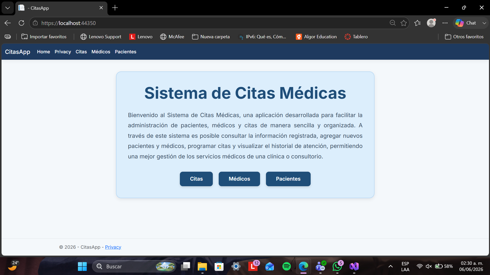
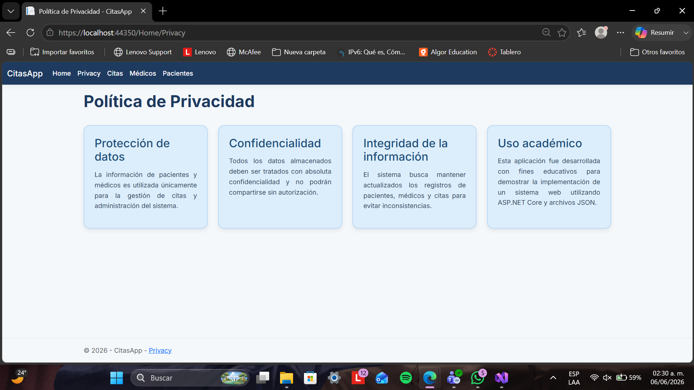
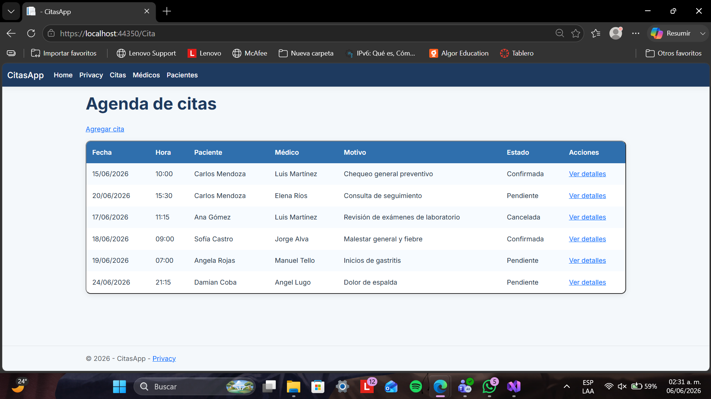
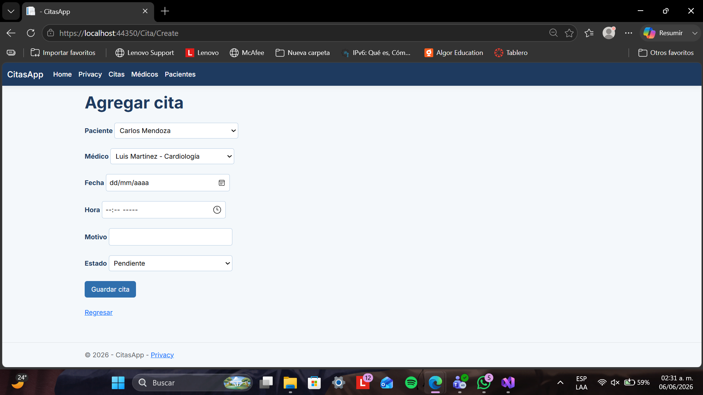
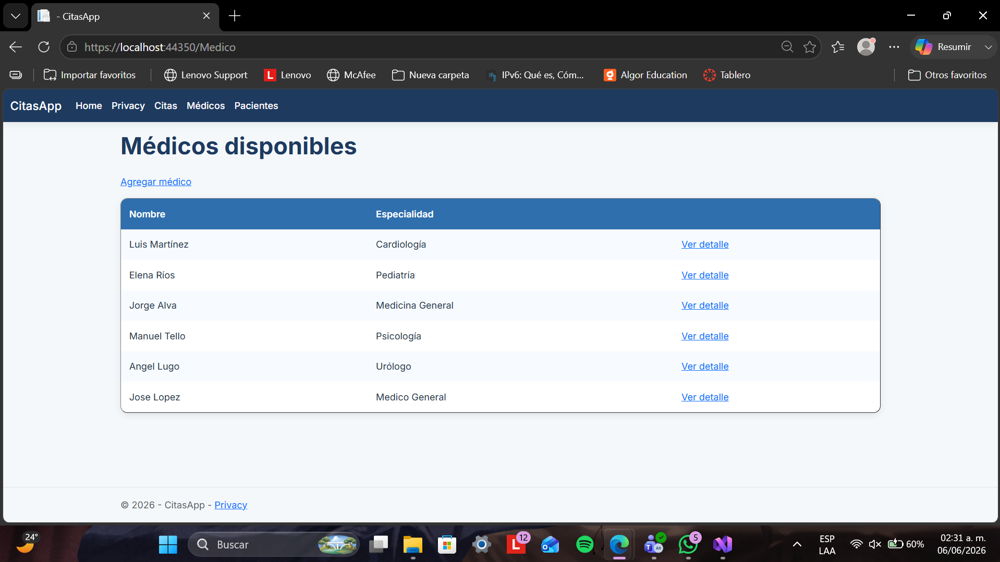
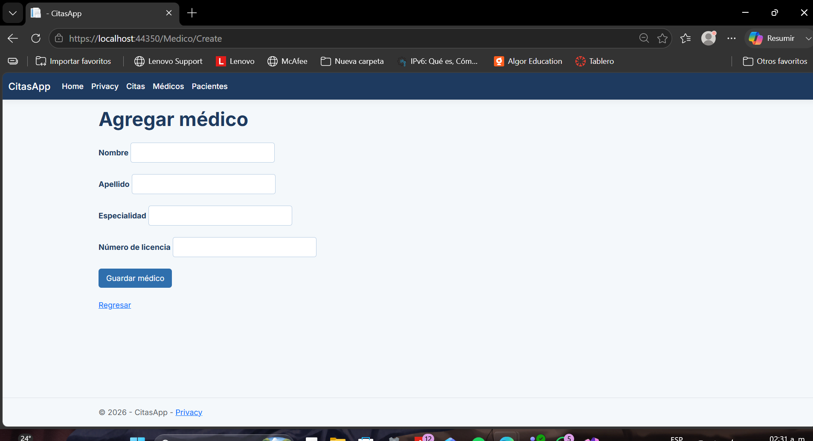
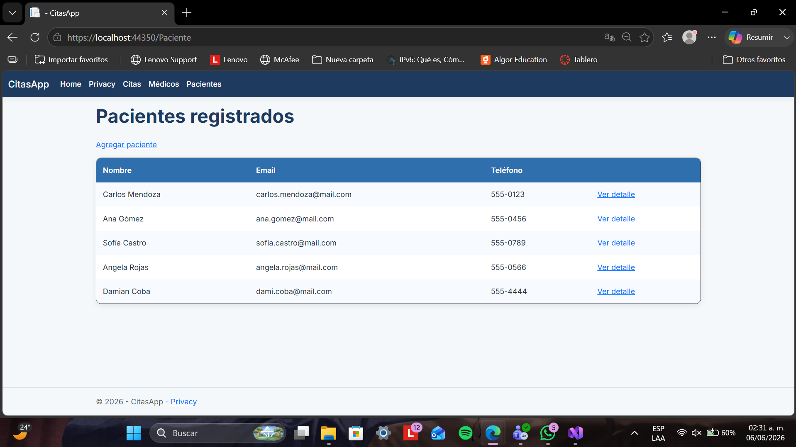
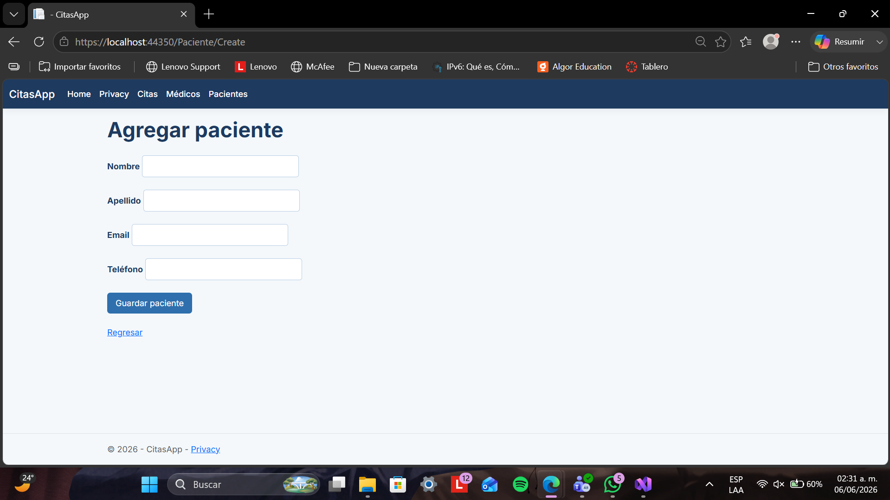

# Actividad #29 – Práctica .NET: Diagramas como código

## 📌 Datos institucionales

- **Universidad:** Tecnológico de Software
- **Materia:** Arquitectura de Software
- **Proyecto:** CitasApp en UML 
- **Alumno:** Ángela Yaritzi Rojas Brito
- **Grupo:** 3B
- **Profesor:** Jorge Javier Pedrozo Romero
- **Fecha:** 08/07/26

---

# 📖 Descripción del proyecto

CitasApp es un sistema de gestión de citas médicas desarrollado en ASP.NET Core que permite administrar la información de pacientes, médicos y citas dentro de un consultorio o clínica.

El sistema ofrece funcionalidades para:

- Registrar pacientes.
- Registrar médicos.
- Programar citas médicas.
- Consultar información almacenada.
- Mantener la persistencia de los datos mediante distintos mecanismos de almacenamiento.

Durante su evolución, el proyecto pasó de una arquitectura MVC tradicional a una solución basada en Arquitectura Hexagonal (Ports and Adapters), permitiendo separar las responsabilidades del sistema y reducir el acoplamiento entre las diferentes capas.

La aplicación fue diseñada para que las reglas de negocio permanezcan independientes de la tecnología de persistencia utilizada. Actualmente el sistema soporta múltiples mecanismos de almacenamiento, tales como:

- Archivos JSON.
- Archivos CSV.
- Base de datos SQLite.
- Persistencia en memoria.

Además, se incorporaron patrones de diseño GOF con el objetivo de mejorar la extensibilidad y mantenibilidad del sistema:

- Factory Pattern.
- Decorator Pattern.

Esta evolución arquitectónica facilita futuras modificaciones, pruebas, mantenimiento y escalabilidad del sistema.

---

# 🚀 Tecnologías Utilizadas

Durante el desarrollo del proyecto se utilizaron las siguientes tecnologías y herramientas:

- ASP.NET Core MVC para la construcción de la aplicación web.
- C# como lenguaje principal de programación.
- Arquitectura Hexagonal para la organización del sistema.
- Razor Views (.cshtml) para la construcción de las interfaces de usuario.
- HTML5 para la estructura de las páginas web.
- CSS3 para el diseño y personalización de la interfaz gráfica.
- JSON como mecanismo de almacenamiento y persistencia de datos.
- Inyección de Dependencias (Dependency Injection).
- Repositorios e Interfaces para desacoplar el acceso a datos.
- Bibliotecas de clases (.NET Class Library) para la separación de capas.
- Visual Studio 2022 como entorno de desarrollo integrado.
- .NET 8 como plataforma de ejecución.
- Git para el control de versiones.
- GitHub para el alojamiento del repositorio.
- Bootstrap para elementos responsivos de la interfaz.
- Arquitectura Hexagonal (Ports and Adapters).
- Patrón Factory Method.
- Patrón Decorator.
- Archivos CSV.
- SQLite.
- Mermaid para documentación de arquitectura.
- C4 ModeL.

---

# 🏛️ Documentación de Arquitectura

La documentación de la arquitectura del sistema, así como el diagrama de componentes realizado con Mermaid, puede consultarse en el siguiente archivo:

- [Arquitectura del Sistema](docs/arquitecturaUML.md)

Este documento describe la evolución arquitectónica del proyecto, los componentes que conforman la solución, las relaciones entre las capas y los patrones de diseño implementados.

---

# 📌 Características

## Funcionales

- Registro de pacientes.
- Consulta de pacientes.
- Edición de pacientes.
- Eliminación de pacientes.

- Registro de médicos.
- Consulta de médicos.
- Edición de médicos.
- Eliminación de médicos.

- Registro de citas médicas.
- Consulta de citas.
- Edición de citas.
- Eliminación de citas.

- Persistencia de información mediante:
  - JSON.
  - CSV.
  - SQLite.
  - Memoria.

## Arquitectónicas

- Arquitectura Hexagonal.
- Arquitectura en Capas.
- Inyección de Dependencias.
- Inversión de Dependencias.
- Repositorios desacoplados.
- Interfaces como puertos del dominio.
- Adaptadores de infraestructura intercambiables.
- Servicios de aplicación.
- Principio Open/Closed.
- Bajo acoplamiento.
- Alta cohesión.
- Documentación arquitectónica mediante Mermaid.
- 
---

# ▶️ ¿Cómo funciona?

La aplicación se encuentra dividida en cuatro proyectos principales que colaboran entre sí para atender las solicitudes del usuario.

## Flujo general

1. El usuario interactúa con la interfaz web.
2. Los Controllers reciben la solicitud HTTP.
3. La capa Application coordina el caso de uso correspondiente.
4. La capa Domain define las entidades y contratos necesarios.
5. La capa Infrastructure proporciona la implementación concreta de dichos contratos.
6. El Factory Pattern selecciona el repositorio adecuado.
7. El Decorator agrega funcionalidades de logging sin modificar el repositorio original.
8. El repositorio accede al mecanismo de persistencia configurado.
9. La información regresa hasta la interfaz para ser presentada al usuario.

---

## Flujo de capas

```
Usuario
   │
   ▼
CitasApp.Web / CitasApp.Api
   │
   │ Solicitudes HTTP
   ▼
Controllers
   │
   │ Casos de uso
   ▼
Application Services
   │
   │ Contratos (Interfaces)
   ▼
Domain
   │
   ├── IPacienteRepository
   ├── IMedicoRepository
   ├── ICitaRepository
   └── ICitaObserver
   │
   ▼
Infrastructure
   │
   ├── RepositoryFactory
   │      │
   │      └── Decide qué repositorio usar
   │
   ├── LoggingPacienteRepository
   │      │
   │      └── Agrega logs (Decorator)
   │
   ├── JsonRepositories
   ├── MemoriaPacienteRepository
   │
   └── Observers
          ├── EmailObserver
          └── SmsObserver
   │
   ▼
Archivos JSON
```

Esta estructura permite modificar la forma de almacenamiento de datos o la interfaz de usuario sin afectar las reglas principales del negocio.

---

## 🎨 Diseño y navegación
Todas las vistas comparten una plantilla común que mantiene una navegación uniforme y una apariencia consistente en toda la aplicación.

### Archivos involucrados:
* `Views/Shared/_Layout.cshtml`
* `wwwroot/css/site.css`
* `wwwroot/js/site.js`

---

# 📁 Estructura del Proyecto

```text
CitasApp.sln
│
├── docs
│   └── arquitectura.md
│
├── CitasApp.Domain
│   │
│   ├── Interfaces
│   │   ├── IPacienteRepository.cs
│   │   ├── IMedicoRepository.cs
│   │   ├── ICitaRepository.cs
│   │   └── ICitaObserver.cs
│   │
│   └── Models
│       ├── Paciente.cs
│       ├── Medico.cs
│       ├── Cita.cs
│       ├── CitaJson.cs
│       └── ErrorViewModel.cs
│
├── CitasApp.Application
│   │
│   └── Services
│       ├── PacienteService.cs
│       ├── MedicoService.cs
│       └── CitaService.cs
│
├── CitasApp.Infrastructure
│   │
│   ├── Repositories
│   │   ├── JsonPacienteRepository.cs
│   │   ├── JsonMedicoRepository.cs
│   │   ├── JsonCitaRepository.cs
│   │   ├── CsvPacienteRepository.cs
│   │   ├── CsvMedicoRepository.cs
│   │   ├── CsvCitaRepository.cs
│   │   ├── SqlitePacienteRepository.cs
│   │   ├── SqliteMedicoRepository.cs
│   │   ├── SqliteCitaRepository.cs
│   │   ├── MemoriaPacienteRepository.cs
│   │   ├── RepositoryFactory.cs
│   │   └── LoggingPacienteRepository.cs
│   │
│   └── Observers
│       ├── EmailObserver.cs
│       └── SmsObserver.cs
│
├── CitasApp.Web
│   │
│   ├── Controllers
│   │   ├── HomeController.cs
│   │   ├── PacientesController.cs
│   │   ├── MedicosController.cs
│   │   └── CitasController.cs
│   │
│   ├── Views
│   │   ├── Home
│   │   ├── Pacientes
│   │   ├── Medicos
│   │   ├── Citas
│   │   └── Shared
│   │
│   ├── data
│   │   ├── pacientes.json
│   │   ├── medicos.json
│   │   └── citas.json
│   │
│   ├── wwwroot
│   │   ├── css
│   │   ├── js
│   │   ├── img
│   │   └── lib
│   │
│   ├── Program.cs
│   └── appsettings.json
│
└── README.md
```

---

# 🧩 Patrones de Diseño Implementados

Durante la evolución del proyecto se implementaron diversos patrones de diseño con el objetivo de mejorar la mantenibilidad, escalabilidad y flexibilidad del sistema.

## Arquitectura Hexagonal (Ports and Adapters)

Permite desacoplar la lógica de negocio de los mecanismos de persistencia y de la interfaz de usuario.

Beneficios:

- Bajo acoplamiento.
- Alta cohesión.
- Facilidad de pruebas.
- Sustitución de tecnologías sin modificar el dominio.

---

## Repository Pattern

Encapsula el acceso a datos y proporciona una interfaz uniforme para trabajar con:

- JSON
- CSV
- SQLite
- Memoria

---

## Factory Method

La clase:

- RepositoryFactory.cs

es responsable de decidir qué implementación concreta del repositorio debe utilizarse dependiendo del entorno de ejecución.

Beneficios:

- Centraliza la creación de objetos.
- Reduce dependencias.
- Facilita agregar nuevas tecnologías de persistencia.

---

## Decorator

La clase:

- LoggingPacienteRepository.cs

agrega funcionalidades de registro y monitoreo al repositorio de pacientes sin modificar su implementación original.

Beneficios:

- Extiende el comportamiento dinámicamente.
- Cumple el principio Open/Closed.

---

## Observer

Se implementó para permitir que el sistema reaccione automáticamente ante la creación de nuevas citas médicas.

Participantes:

- ICitaObserver
- EmailObserver
- SmsObserver

Beneficios:

- Bajo acoplamiento.
- Permite agregar nuevos observadores fácilmente.
- Facilita la extensión del sistema de notificaciones.

---

## Descripción de las capas

### CitasApp.Domain

La capa **Domain** contiene las entidades principales del sistema y las interfaces que definen los contratos para el acceso a los datos. Aquí se encuentran los modelos de negocio como Paciente, Médico y Cita, así como las interfaces de los repositorios. Esta capa representa las reglas fundamentales del sistema y no depende de ninguna otra capa, lo que permite mantener la lógica del dominio independiente de tecnologías específicas.

### CitasApp.Application

La capa **Application** contiene los servicios y casos de uso de la aplicación. Su función es coordinar la lógica necesaria para atender las solicitudes realizadas por los usuarios, actuando como intermediaria entre la interfaz web y el dominio. Esta capa organiza los procesos de negocio sin preocuparse por detalles de almacenamiento o presentación.

### CitasApp.Infrastructure

La capa **Infrastructure** contiene las implementaciones concretas de los contratos definidos en el dominio. En este proyecto se encarga de la persistencia de los datos mediante archivos JSON, utilizando repositorios especializados para la lectura y escritura de la información de pacientes, médicos y citas.

### CitasApp.Web

La capa **Web** corresponde a la interfaz de usuario desarrollada con ASP.NET Core MVC. Incluye los controladores, vistas, recursos estáticos y configuraciones necesarias para que los usuarios interactúen con el sistema. Esta capa recibe las solicitudes del usuario y muestra la información procesada por las demás capas.

## CitasApp.Api

La capa **Api** expone la funcionalidad del sistema mediante servicios REST, permitiendo que aplicaciones externas consuman la información del sistema de citas médicas.


---

# 📷 Capturas de pantalla


















---

# 🤖 Cláusula de IA

Durante el desarrollo del proyecto se utilizaron herramientas de Inteligencia Artificial (IA) como apoyo académico y técnico para complementar el proceso de aprendizaje y desarrollo del sistema.

La IA fue utilizada específicamente para:

- Brindar soporte en la resolución de errores de compilación, configuración y depuración del proyecto.
- Generar sugerencias para la organización de la solución y la separación de responsabilidades entre las capas.
- Apoyar en la elaboración de la documentación técnica del sistema, incluyendo:
  - `arquitectura.md`
  - Diagramas realizados con Mermaid.
- Proporcionar recomendaciones para el diseño visual de la interfaz y la personalización mediante CSS.
- Servir como herramienta de consulta para la comprensión de conceptos, tecnologías y buenas prácticas de desarrollo de software.

La Inteligencia Artificial fue utilizada únicamente como una herramienta de apoyo y consulta. Todas las decisiones de diseño, implementación, integración, pruebas, corrección de errores y validación final del sistema fueron realizadas por la autora del proyecto.

---

# 📂 Contacto

- Hecho por: Ángela Yaritzi Rojas Brito
- Correo: angela.rojas@tecdesoftware.edu.mx


