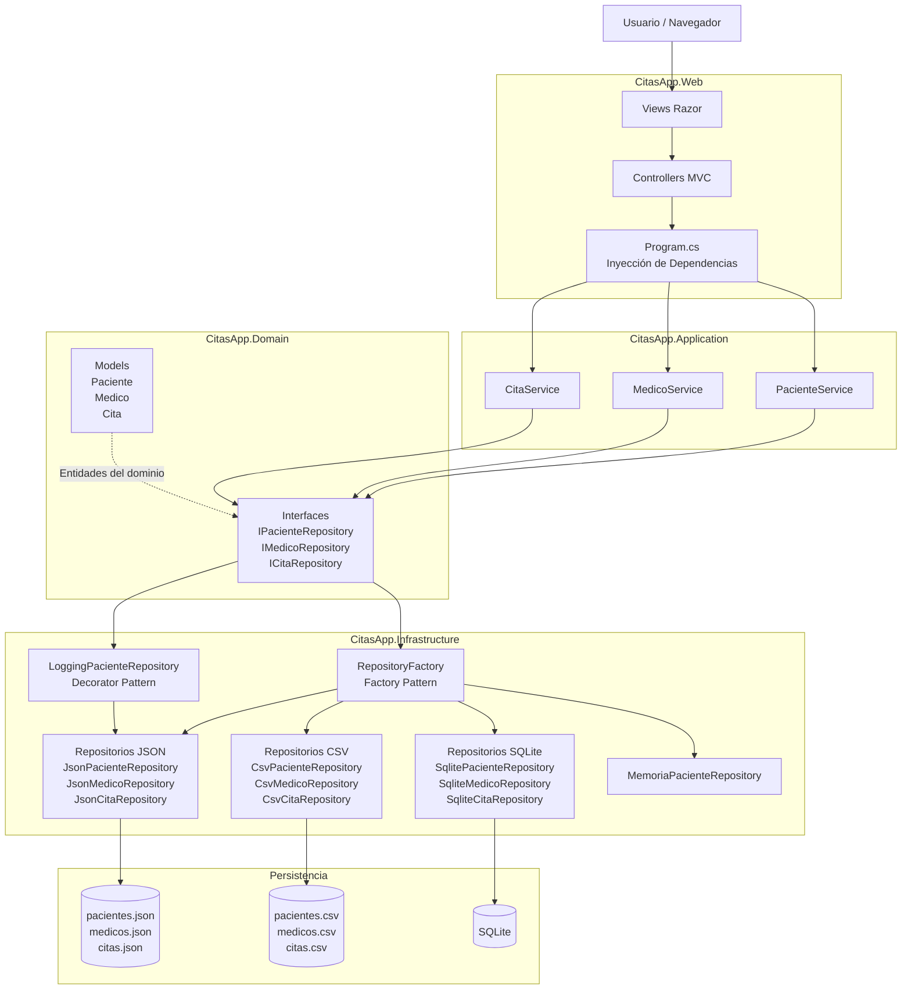

# Componentes de CitasApp

**Objetivo**

Este diagrama muestra el flujo completo de CitasApp, desde la interacción del usuario hasta la persistencia de los datos, incluyendo la evolución hacia una Arquitectura Hexagonal y la incorporación de los patrones GOF Factory y Decorator.

---

